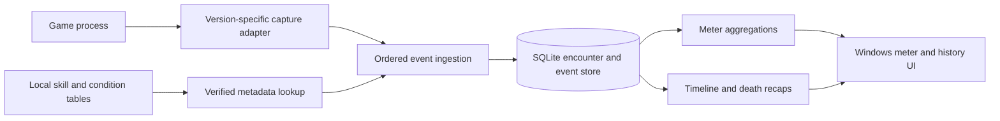

# Sora 2 Details — build plan

Prepared 2026-09-25 for the installation at `C:\Games\Trails in the Sky 2nd Chapter`.

**Priority clarified 2026-09-27:** the [advanced command-battle log](docs/COMBAT-LOG-PRIORITY.md) is the primary deliverable. The meter is a visual projection of that log. Capture must include actions and outcomes that cause no HP change, preserve unknown raw results, and expose every known coverage gap before a fight is called complete.

Implementation status: the .NET solution contains the compact WPF meter, breakdown/history/timeline windows, combat-event models, projection logic, version-gated capture pipe, encounter recorder, and durable JSON history. One player-confirmed command-battle attack path produced a partial real damage replay, while automatic game capture remains unimplemented. See [implementation status](docs/IMPLEMENTATION-STATUS.md) for verified behavior and remaining gates.

## Recommendation and feasibility

Build a local Windows combat recorder with persistent, ordered command-battle transcripts; the compact meter, history, and timelines read from those transcripts. The UI and history scaffolding are working. Reliable capture of complete actions and outcomes remains the research dependency: no usable combat log was found in the install directory, and later live probes verified only partial event paths.

The static scan provides promising starting points: a native x64 executable, accessible FPAC archives, readable skill/condition tables, and battle lifecycle and attack-hit strings. These are evidence that targeted investigation is practical, not proof that a complete event stream is available. See [the scan report](docs/INSTALLATION-SCAN.md) for evidence and limitations.

A later static disassembly pass mapped exact version-specific string references, function ranges, and script dispatch paths. Its findings and the live verification sequence are in [the hook research handoff](docs/HOOK-RESEARCH-HANDOFF.md). It did not establish a resolved damage hook.

**First deliverable: a capture feasibility transcript, not a polished meter.** Demonstrate reliable boundaries, action execution, and every observed per-target outcome in a controlled command battle, including an action with no HP change. Record unknown codes and gaps rather than omitting them. Only then claim the log's tested coverage.

## Intended experience

The complete command-battle transcript is the source of truth. The compact meter below is a convenient summary; selecting a number should lead back to its contributing log entries.

```text
[Current encounter / selected fight v]   [Damage v]   [Settings]
Estelle          █████████████       12,450   46%
Joshua           ███████████          9,830   36%
Other ally       █████                4,880   18%
[Details]                                      [Timeline]
```

Illustrative names and numbers above are mock data.

- Encounter dropdown: Current, the ten most recent completed fights, then **More…**. Ten is a navigation limit, not a storage limit.
- More opens the full saved history with paging/search and filters for date, enemies, outcome, and capture completeness. Selecting an older encounter leaves it selected while new fights are recorded; Current restores live following.
- Four modes: **Damage, Healing, Taken, Deaths**. Totals and percentages are the primary numbers. Damage per action is useful later; real-time DPS can mislead when menus, pauses, or animation speed affect elapsed time.
- Clicking a row opens its breakdown. Preserve the selected encounter when switching modes.
- A small always-on-top desktop window is the first UI target. Borderless/windowed gameplay is the initial supported setup. Add compact styling, resizing, opacity, position persistence, and a configurable focus/show hotkey. Verify fullscreen behavior separately.

| Mode | Default rows | Drill-down |
| --- | --- | --- |
| Damage | Party members, damage dealt to enemies | Move → targets; uses, damaging hits, total, mean per use, physical/magical/unknown split |
| Healing | Party members, effective HP restored | Move/item → recipients; effective healing, observed overheal if available |
| Taken | Enemy sources, damage dealt to the party | Enemy → attack → victims; optional group-by attack or victim; Timeline button |
| Deaths | Party members, knockout count | Each knockout opens the final sequence leading to it, HP trail, and known killing event |

Taken should answer **which enemy attacks are hurting us** by default. Preserve enemy instance identity so two enemies with the same name can be distinguished. Include separately labeled status/environment/unknown sources when applicable so damage does not silently disappear from the total.

## Timeline and death recaps

Retain the complete encounter event stream, not just running totals. The combat-log button shows all recorded events for the selected encounter; incomplete live captures must remain visibly partial. Allow filters for victim, attacker, move, event type, and damage classification. Keep healing, mitigation, and status context available even when opened from Taken. Death recap remains a short victim-focused window ending at the knockout.

Each row should show action order, observed elapsed time, source, move, target, amount, HP before → after, and known classification. Group multiple targets/hits under their parent action. Treat action order as primary during command battles; timing is supplemental and should specify whether it is recorder time or verified game time.

For every confirmed knockout, create a stable marker pointing to the lethal event and its preceding sequence. Default to the last 10 relevant actions affecting the victim, with surrounding party actions expandable. Include healing, status changes, and mitigation where captured. Record repeated deaths after revival separately. Deaths here means combat knockouts, not permanent story deaths.

If the source of a status tick or instant knockout is unknown, show that explicitly. An HP value reaching zero is useful evidence but does not by itself identify the killer. HP disappearing during a scene transition must not create a death.

## Scope decisions

- Confirmed scope: command battles only. Field combat is outside the product scope and roadmap.
- Command encounters begin at a verified battle activation boundary and end at a verified result/escape/defeat/abort boundary. Do not use a quiet period or last enemy HP alone as the normal boundary.
- Keep one encounter across waves/phases while the game remains in the same battle. Retries create new attempts with an optional link to the previous attempt.
- Attach during a battle: record a clearly marked partial encounter; do not imply earlier actions were recorded. Disconnect, load, crash, and forced quit finalize interrupted/partial records.
- Snapshot HP and relevant status at command-battle entry as the starting state. Exclude preceding field-combat damage, healing, and knockouts from encounter totals and recaps. Validate that shared combat callbacks cannot leak field events into a command encounter.
- English labels are the initial metadata target because the English archive was inspected. Record IDs independently so other locales can be added.
- Only locally recorded fights populate history; this plan assumes no way to reconstruct past fights from existing saves.

## Capture strategy, in order

| Route | Investigation | Suitability |
| --- | --- | --- |
| Existing logging or retained event buffer | Inspect relevant runtime logging and battle structures; check game-specific user-data logs | Best if it already exposes complete action and outcome records; not established by the scan |
| External read-only process inspection | Locate roster, HP, encounter state, action identity, and any retained result queue | Good discovery path; a result queue might suffice. HP polling alone cannot meet the full requirements |
| Small native observer inside the process | Instrument verified action/damage resolution and lifecycle paths; forward copied event records | Likely route if no complete external event source exists; requires version-specific reverse engineering and runtime validation |
| Screen OCR | Read visible numbers/names | Unsuitable as the authoritative recorder: occlusion and fast animations are the exact problem being solved |

Use the least invasive route that passes the same event-completeness tests. A DLL is conditional, not an installation assumption. Static tables can label runtime events but cannot reveal which attacks actually occurred.

For a native observer, locate the resolved combat-result path rather than counting animation callbacks. A move can animate many times while applying one result, or apply multiple results before the next screen refresh. Capture resolved values and relevant before/after state without changing combat results. Copy bounded records to a queue; a worker transmits them. No disk writes, UI work, or blocking pipe calls inside a combat hook.

Strings such as `btlcom.OnAttackHit` and `btlsys.BattleStart` are navigation leads, not confirmed exported hooks or stable function signatures. A loose-file loader for this title provides a reference for native integration, but does not provide a combat API. Validate any loader mechanism against this exact executable and existing mods before adoption.

## Meaning of the numbers

- Keep **action category** (normal attack, Craft, S-Craft, Art, item, status, unknown), **damage class** (physical, magical/Arts, other, unknown), and **element** separate. An action's category or visual effect is insufficient proof of its damage formula.
- Prefer runtime damage classification; use verified skill-table mappings when supported. Record provenance per field. Unknown is a valid value and is excluded from classified percentages or shown as its own share.
- Store the resolved damage amount separately from effective HP lost. Default meters to effective HP damage; offer resolved damage when verified. This prevents overkill from inflating the default contribution comparison.
- Effective healing is actual HP restored. Keep resolved healing and overheal only when observed or correctly derivable. Do not infer an uncapped amount from capped HP changes.
- Track shields/absorption/prevention separately from HP healing when exposed. Do not label a shield application as healing. Distinguish miss, zero damage, absorption, reflection, and unknown outcomes.
- Record instant knockout as an outcome even if it has no numeric HP damage result. Preserve status origin only if traceable.
- Link area effects, multiple hits, follow-ups, counters, and reflections to action IDs when available. Count uses from action execution, not target count. Represent canceled/interrupted actions without inventing hits.
- Damage and Taken use team relations at event time. Self damage, friendly fire, reflection, and unattributed damage remain visible in details and recaps with explicit categories.

## Proposed architecture



The scaffold uses C#/.NET 9 with WPF for the Windows app and keeps capture behind an interface. SQLite remains the planned persistence option, Python is suitable for offline archive/research utilities, and C++ x64 may be needed for an in-process adapter. Replayed fixtures drive the same projection logic planned for captured events.

If capture runs in the game, use a local named pipe with versioned messages, process/session identity, sequence numbers, and a handshake. Detect dropped events and disconnections; mark affected encounter totals incomplete. A slow or stopped UI must not block gameplay. Use bounded buffering and expose loss rather than claiming exact totals. Persist events in short transactions and recover unfinished encounters after app restart.

Record at minimum:

| Record | Fields |
| --- | --- |
| Capture session | Session ID, executable SHA-256/version, adapter version, capabilities, process identity, start time |
| Encounter | Encounter/attempt ID, session, command-battle start/end, entry state, outcome, roster, display label, completeness and gap flags |
| Actor instance | Encounter-scoped identity and spawn generation, game actor/template ID where known, localized name, team |
| Action | Action ID, source, move ID/name, category, action order/turn if known, execution/cancellation state |
| Event | Unique sequence, encounter/action IDs, monotonic capture time, source/target, event kind, resolved/effective amount, HP before/after, damage class/element, outcome flags |
| Evidence | Per-field origin (runtime/table/inferred/unknown), adapter raw codes needed for debugging, metadata version |
| Death | Victim, sequence, linked lethal event if known, recap range, revival/next-death relationship |

Use nullable fields rather than made-up zeros. Store immutable events and rebuild aggregates from them. Enforce uniqueness on session plus sequence for reconnect/replay deduplication. Do not deduplicate legitimate identical hits by comparing names and amounts.

Keep runtime observation separate from metadata enrichment so mappings can improve without destroying original evidence. Store enough label snapshots to display old encounters after updates. Store the database in the application's user-data directory, outside the game installation. Provide local JSON/CSV export and explicit history deletion later; do not automatically discard fights beyond ten.

## Build sequence and acceptance gates

The [log-first coverage contract](docs/COMBAT-LOG-PRIORITY.md) governs these gates. Existing UI scaffolding is useful but does not satisfy a capture gate.

### 1. Prove combat-log capture feasibility

1. Identify the exact executable and relevant table schemas; use the scan fingerprint as the starting target.
2. Inspect any candidate logger/event buffer before implementing hooks.
3. During a controlled battle, locate party/enemy instances, HP, active action, and battle lifecycle. Validate across restarts, not just one memory layout.
4. Trace execution of a normal attack, enemy attack, Art, Craft, support/no-HP action, and heal. Capture actions independently of results, then trace each per-target outcome to the application path, including misses or zero results where available.
5. Record a knockout and a battle end. Repeat at normal and accelerated/skipped animation settings supported by the game.

**Exit artifact:** an ordered raw action-and-result transcript, a coverage ledger and field-availability matrix, documented offsets/signatures or buffer layout for this build, and a comparison against observed actions. Unknown or uncaptured classes remain explicit. No polished overlay required.

**Proceed with full log scope** only when command boundaries, action executions, per-target outcomes, attribution, and gap detection are reliable across tested classes. A reduced recorder may still show verified damage totals with explicit Unknown labels and coverage gaps, but must not call its transcript complete. Intermittent HP differences alone do not establish a combat log.

### 2. Build the durable combat-log recorder and encounter model

Implement the chosen adapter, capability reporting, version detection, lifecycle state machine, actor identities, independent action records, per-target outcomes, unknown raw codes, local transport if needed, database, and replay input. Cover victory, escape, defeat, retry, attach mid-battle, and disconnect. Unknown builds must stop capture with a clear unsupported-version status rather than reuse unchecked offsets.

**Acceptance:** replaying a recorded fight reproduces its action/result count, order, boundaries, and meter totals; reopening the app restores the transcript; retries and simultaneous same-name enemies remain distinct; dropped or unsupported events visibly mark incomplete coverage.

### 3. Project the log into the meter MVP

Implement Damage, Healing, Taken, selected encounter, Current, latest ten, More history, and actor/move drill-down. Display capture state and unknown classifications alongside real data.

**Acceptance:** complete an eleventh fight and still find the first through More; selecting history survives subsequent battles; drill-down totals reconcile with their parent rows; overheal/overkill follow the stated definitions.

### 4. Deliver timelines and deaths

Add recent/full timeline, filters, action grouping, HP trails, per-knockout markers, and recap navigation. The event store already exists from phase 2, so this does not depend on adding a second recording system.

**Acceptance:** an observed death can be traced through incoming attacks and intervening heals to the lethal event; repeated deaths and instant knockout remain distinct; missing evidence is labeled rather than attributed by guesswork.

### 5. Harden and extend

Validate normal/accelerated/skipped presentation, long sessions, process shutdown, app reconnect, patch rejection, localization, window focus, and any proxy-DLL conflicts. Add export, optional secondary metrics, and presentation polish after capture correctness.

## Validation matrix

Use controlled fights and local recordings; synthetic fixtures verify application logic but do not prove the capture adapter works.

| Scenario | What must be established |
| --- | --- |
| Basic physical attack and Art | Correct attacker, victim, move, amount, and separately validated classification |
| Support action, miss, evade, guard, or canceled action | Execution appears in the log even without an HP change; target outcomes and unknown codes are retained |
| Multiple targets and repeated hits | No dropped/duplicate results; one action with the right children; visual hits are not assumed to equal HP applications |
| Heal near full HP and hit near zero HP | Effective amounts and observed excess are separated correctly |
| Shield, miss, reflection, counter | Zero/mitigated results and reflected sources are not confused |
| Status tick, regeneration, instant knockout, revival | Causal context retained when available; unknown source stays unknown |
| Animation acceleration/skip and paused menus | Totals invariant; sequence remains meaningful; elapsed-time semantics explicit |
| Waves, escape, retry, load, attach mid-fight | Correct boundaries and completeness flags |
| Field combat leading into a command battle | Entry HP/status captured as baseline; preceding field events excluded from totals and death recaps |
| Adapter/app reconnect or queue overflow | No silent loss, duplicate ingestion, or blocking of the game |
| New executable version | Adapter refuses unvalidated capture and gives an actionable compatibility message |

Reconcile HP transitions against captured changes and flag mismatches, but do not use reconciliation alone as proof of attribution. Compare recordings against manually noted moves and visible results during capture research.

## Effort and next task

Budget an initial **2–5 focused development days** for capture research as a timebox, not a guarantee of a solution. If a stable event source is found, a rough planning allowance for recorder, UI, timeline, and validation is **several additional weeks (approximately 3–6)** for one developer. Reverse engineering can exceed this substantially; estimates should be replaced after phase 1. These are planning judgments, not measured project estimates.

The immediate live task is **capture a command battle's boundaries and independent action stream**, then join all observed per-target outcomes into an ordered transcript for this exact build. A loaded save and reproducible fight are needed for that gate. Earlier bounded live probes verified one attack/HP path and partial meter replay; they did not prove complete logging. The original 2026-09-25 planning scan did not launch or modify the game.
