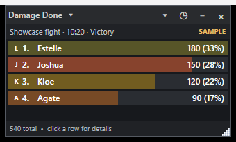

# Sora 2 Details

Windows **command-battle combat logger** for **Trails in the Sky 2nd Chapter**, with a Details-like meter as one view of the log. [Complete action and outcome capture](docs/COMBAT-LOG-PRIORITY.md) is the primary goal. The app shows sample replay data until recorded encounters exist. A bounded, read-only **partial live capture** is now available for the validated English game build.

## Run

The easiest shareable build is the **Windows x64 preview installer** on [GitHub Releases](https://github.com/rebelshadowrm/Sora2-Details/releases). Install once, start the validated game, then open **Sora 2 Details** from the desktop or Start menu. The meter starts partial live capture automatically; approve the Windows administrator prompt. Click **■** to detach or **●** to retry. The app normally finds the game's folder from its running process; if Windows hides that path, the first capture asks you to select `sora_2nd.exe` and remembers the successful location. The installer itself does not need a game-folder step. The **↻** control checks for a newer preview, and **↑** downloads it and restarts the app after capture detaches. The installer bundles the required Python runtime and .NET app; no separate Python or .NET installation is needed. The meter still displays saved encounters when the game is closed. Capture is limited to the verified game executable SHA-256 and remains partial.

Build an installer locally with `& .\tools\build_installer.ps1 -Version 0.2.0-preview.10`. This creates a Velopack Setup executable, portable ZIP, full update package, and `releases.win-x64-preview.json` under `releases\velopack-preview`. The script verifies the pinned Python embedded-runtime download. Push a `vX.Y.Z-preview.N` tag to run the Windows release workflow; it publishes the installer and update feed as a GitHub prerelease. Install settings, encounters, and raw probe traces live under `%LOCALAPPDATA%\Sora2 Details`, outside the app directory that Velopack replaces during updates.

For an installed local build, double-click `Start-Sora2Details.cmd`. With the validated game running, this starts the meter and partial live capture; Windows may ask for administrator approval for the read-only probe. Without the game, it opens saved encounters. Use `Stop-Sora2Details.cmd` to detach capture cleanly. Clicking the always-on-top meter gives it keyboard focus; click the game to resume control. The meter no longer takes focus merely by opening.

The small status label shows Ready, Capturing, Stopping, or Error; click it to read the full capture message and installed version. Closing the meter while capture is active requests a clean detach before exit. If detachment fails, it warns before allowing an explicit exit anyway. History lists the local time, outcome, and PARTIAL status for each encounter.

Open **Display settings** from the meter-title menu or right-click the header. Position lock, whole-window opacity, always-on-top, text size, and click-through persist in `%LOCALAPPDATA%\Sora2 Details\meter-display.json`. Click-through passes mouse clicks to the game; double-click the Sora 2 Details system-tray icon or use its **Restore interaction and show meter** command to turn interaction back on. Resize the meter directly to show more or fewer rows. The existing meter position and size continue to use `meter-window.json`.

The older ZIP-only builder remains available as `& .\tools\build_release.ps1`. That ZIP requires 64-bit Python 3.11+ for live capture. Use the Velopack installer above for the bundled runtime and updater. See [release notes](RELEASE-NOTES.md).

Development commands require the .NET 9 SDK and Windows desktop runtime.

To try UI changes without replacing the installed meter, run `powershell.exe -NoProfile -ExecutionPolicy Bypass -File .\tools\test_local_meter.ps1` from the repository. It opens a separate sample-replay window with live capture disabled and stores its placement/display settings under `.research-deps\local-meter-test`. Close that window and run the same command again to check persistence. The installed app and its `%LOCALAPPDATA%\Sora2 Details` data remain separate.

```powershell
dotnet build Sora2.Details.sln -c Release
dotnet run --project src/Sora2.Details.Desktop -c Release
dotnet run --project tests/Sora2.Details.Checks -c Release
```

The compact meter opens with three invented command battles from `samples/command-battles.json` when no recorded history exists. Click the title to switch Damage, Healing, Taken, or Deaths. Hover a colored row to preview its next breakdown, click to enter it, and right-click or use ‹ to go back. The deepest hit rows show effective damage and known overkill; hover for total hit, effective amount, and overkill. In Deaths, click a character's count to list their knockouts in the meter, then click a knockout to open its recent recap. The clock button opens the full recorded combat log for the selected encounter, with color-coded events and remembered window placement. The arrow opens the most recent ten encounters and **More…** for full history. Sample labels and values are demonstration data, not extracted game results.

Capture messages can now be assembled and saved to `%LOCALAPPDATA%\Sora2 Details\encounters`. The window watches that folder and follows the active session's newest command battle. Until one starts, it shows a waiting state; an already-open battle cannot be reconstructed. The encounter menu's **Current / live** item returns from saved history to the active session. It also listens for a version-gated local [capture pipe](docs/CAPTURE-PROTOCOL.md). Incomplete encounters are marked `PARTIAL`, with reasons in the footer tooltip. `LIVE / PARTIAL` means the bounded probe supplied real game observations; it does not mean every action was captured.

If Retry or a save reload resets party status records after a completed fight, the live view returns to "waiting" while preserving that attempt in history. A new meter entry still requires the verified command-battle entry hook; field activity does not create one.

A confirmed Walter Retry inside an active capture bypassed both battle boundary callbacks. When four party members are knocked out, even across several turns, and one of those members next appears at full HP without an observed heal, the bridge starts a separate partial attempt and labels the defeat/retry boundary as inferred. Other retry patterns remain unverified; see [the Walter retry trace analysis](docs/RETRY-WALTER-20260928.md).

For a bounded live session while the exact supported game executable is running, use `& .\tools\start_live_meter.ps1 -Seconds 600`. Approve the Windows administrator prompt for the read-only probe. The script opens the meter, saves command-battle observations under `%LOCALAPPDATA%\Sora2 Details\encounters`, and detaches automatically at the time limit; `& .\tools\stop_live_meter.ps1` detaches early. Start capture **before** entering a command battle. The latest encounter is followed automatically until you select older history. See [the live capture result and limitations](docs/LIVE-METER-20260927.md).

For an ordinary play session, `& .\tools\start_session_logger.ps1` keeps the partial command-battle logger and meter running for up to 12 hours with one administrator prompt. It saves raw traces for later research and durable per-fight projections. See [session logger](docs/SESSION-LOGGER.md) for recovery, file locations, and coverage limits.

Click a source row to show its moves in the meter; the number in parentheses is the recorded hit count. Hover a move to preview its hits, then click it to show them in the meter. Captured damaging hits use exact English skill-table names when their live effect descriptor uniquely matches a row. Unmatched results remain separate, ordered hits rather than a false move total. Hover an individual hit for its time, target, amount, damage type, critical status, raw result flags, and HP trail.

Move rows with a verified packed skill ID can show the game's Attack, Craft, S-Craft, or Art-element symbol. The table yields a shared category or element icon, not a unique picture for every move. On this installed English build, `python tools/extract_meter_icons.py 'C:\Games\Trails in the Sky 2nd Chapter\pac\steam\image.pac'` extracts the small symbols and AT portraits into `%LOCALAPPDATA%\Sora2 Details`; the script requires Pillow and `lz4` (install them into `.research-deps\py` if needed). The generated icon lookup comes from the hash-checked English skill table. An unmatched or ambiguous ID keeps its letter tile.

Party bars and letter tiles use character-specific colors for Estelle, Joshua, Scherazard, Olivier, Kloe, Agate, Tita, Zin, Anelace, Kevin, Josette, Julia, and Mueller. Enemy and unknown-source rows keep the rotating fallback colors. The extractor uses `t_name` character-model keys to locate the game's AT turn-bar portraits for 11 verified party names, then writes cropped PNGs to `%LOCALAPPDATA%\Sora2 Details\portraits`. Julia and Mueller still use letter tiles because this English table has no verified portrait join for them. Existing PNGs in that folder are preserved, so a custom `<Character>.png` can override an extracted portrait; `--overwrite-portraits` explicitly replaces them. Restart the meter after changing portrait files.
The meter remembers its position and size across restarts in `%LOCALAPPDATA%\Sora2 Details\meter-window.json`. Move or resize it normally; the placement is saved shortly afterward and again when the window closes. If a saved position is no longer visible after a monitor change, the meter opens centered on the primary work area.

The [damage-type and crit probes](docs/DAMAGE-TYPE-AND-CRIT-20260927.md) support exact `0x42000` as Physical for ordinary Attacks. A player-confirmed Shatter Break result shared `0x52000` with Arts, so that flag is **not** a reliable Arts classifier. The live skill-table join provisionally classifies matched row codes `0xC`/`0xE` as Physical and `0xF` as Arts, with provenance. Unmatched patterns remain Unknown. Controlled critical and non-critical hits disproved the apparent source-context `+0x30` and target-status `+0x7C` patterns as universal per-hit crit detectors: a player-confirmed non-critical Stone Hammer had value `3` in both fields after two reported crits. The logger preserves both raw values for research and leaves automatic critical status unverified.

A [player-verified command-battle probe](docs/ATTRIBUTED-ATTACK-LIVE-RESULT.md) now produced a **partial live damage replay with character attribution**: Estelle 32,535, Agate 20,284, Scherazard 4,991, and Tita 2,076 effective damage, totaling the two observed enemy HP pools of 59,886. One controlled Agate normal Attack was independently checked against an obscured on-screen number and a matching 10,452 HP loss. Most move names, damage class, complete effect coverage, and a reliable automatic start boundary remain unverified. To inspect the real observed values without adding them to normal history, set `SORA2_DETAILS_RESEARCH_REPLAY` to the absolute path of `samples/research/attributed-attack-20260926.partial.json` before launching the desktop app. The window labels this view `RESEARCH` and `PARTIAL`; drag its encounter or footer line to move it. An earlier [all-actor HP-path test](docs/FULL-HP-PATH-LIVE-RESULT.md) also recorded partial Taken and Healing totals.

An additional [live source-name lookup check](docs/SOURCE-NAMES-AND-CRITS.md) matched four known party status IDs and three enemy instances to names in this build's English status table. The live bridge now applies the hash-gated `t_name` ID lookup for those four verified party IDs and attempts a provisional, unique stat-signature match for enemy snapshots. In a [blind live check](docs/LIVE-METER-20260927.md), it independently named three separate Duster Geist instances before the player confirmed the on-screen name. Ambiguous or missing matches stay unnamed; critical hits still need a verified per-result flag.

An [English table linkage audit](docs/TABLE-LINKAGE-AUDIT.md) maps party IDs, monster-setting unit keys, move IDs, and item IDs across this exact build's archives. The expanded live capture reads packed skill IDs from damaging-hit descriptors and matches them to `t_skill`. Uniquely matched enemies can also receive provisional `?` move names from their per-monster English AI scripts. Ambiguous enemy identities, item IDs, and direct enemy unit keys remain unresolved.

A [live action-context test](docs/ACTION-ID-PROBE-20260927.md) paired 19 attack results to enemy HP writes in a player-confirmed victory and reproduced both 38,825-HP enemy pools. Its [research replay](samples/research/action-id-attack-20260927.partial.json) preserves the earlier result. The newer effect-descriptor join resolves many damaging-hit move IDs, but support/status actions, misses, and unmatched HP writes remain outside a complete action log.



## Project layout

| Path | Purpose |
| --- | --- |
| `src/Sora2.Details.Core` | Combat event model, capture pipe and codec, encounter assembler/recorder, durable store, replay loader, meter and timeline projections |
| `src/Sora2.Details.Desktop` | WPF meter, history picker, timeline and death recap windows |
| `samples/command-battles.json` | Synthetic command-battle replay |
| `tests/Sora2.Details.Checks` | Replay and projection checks with no external test framework dependency |
| `BUILD-PLAN.md` | Product scope, capture research gate, architecture, acceptance criteria |
| `docs/INSTALLATION-SCAN.md` | Read-only findings from the local game installation |
| `docs/HOOK-RESEARCH-HANDOFF.md` | Build-specific combat hook candidates, evidence, and live verification steps |
| `docs/SORA2LOOSELOAD-ASSESSMENT.md` | Source-grounded assessment of the loader, debug log, and native integration path |
| `docs/ELEVATION-AND-NEXT-SESSION.md` | One-prompt live probe workflow and next player-assisted test |
| `docs/TABLE-LINKAGE-AUDIT.md` | Exact-build joins among character, status, monster, skill, and item tables |
| `docs/COMBAT-LOG-PRIORITY.md` | Log-first scope, coverage contract, current model gap, and acceptance gates |
| `docs/CAPTURE-PROTOCOL.md` | Local pipe wire format and executable-version gate |
| `tools/static_hook_scan.py` | Reproducible read-only PE/string cross-reference scan |
| `tools/name_table_index.py` | Hash-gated English `t_name.tbl` ID/name research lookup |
| `tools/skill_table_index.py`, `tools/item_table_index.py`, `tools/monster_setting_index.py` | Hash-gated move, item, and monster-setting research lookups |
| `tools/check_table_linkage.py` | Repeatable cross-table checks against the exact English archive |
| `tools/hp_memory_probe.py` | Read-only candidate HP memory scanner for controlled runtime research |

## Project skills

The repository includes three Codex skills in `.agents/skills`: [sora2-meter-build](.agents/skills/sora2-meter-build/SKILL.md) for implementation, [sora2-meter-lookup](.agents/skills/sora2-meter-lookup/SKILL.md) for ID/table mapping, and [sora2-meter-test](.agents/skills/sora2-meter-test/SKILL.md) for validation. Invoke them explicitly as `$sora2-meter-build`, `$sora2-meter-lookup`, and `$sora2-meter-test` when handing work to another agent.

## Next implementation boundary

Start with the [live session result](docs/SESSION-LOGGER.md), [table audit](docs/TABLE-LINKAGE-AUDIT.md), and [damage-type comparison](docs/DAMAGE-TYPE-AND-CRIT-20260927.md). The bounded bridge now records observed HP effects, paired attack results, and exact-table move names on uniquely matched damaging hits. A unique action execution record, misses, support effects, enemy move rows, and decoded outcomes are the next gates for a complete combat log.

Only command battles are in scope. Field actions before battle entry should appear only as the starting HP/status state once live capture exists.
